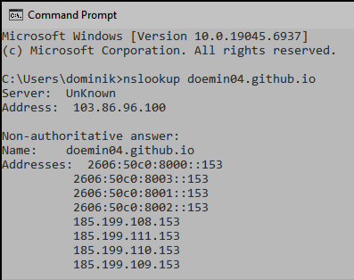
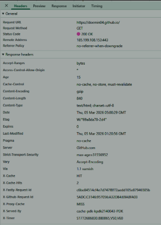

# 🌐 Computer Networking Website 

This repository contains the source code and documentation for a publicly accessible website, demonstrating the practical application of basic networking concepts including DNS resolution, IP addressing, HTTP/HTTPS protocols, and application security.

## 🔗 Live Deployment
**Visit the site here:** [https://doemin04.github.io](https://doemin04.github.io)

## 🛠️ Architecture & Setup
* **Hosting:** GitHub Pages (Static Hosting)
* **Domain:** `doemin04.github.io` (Free sub-domain)
* **Tech Stack:** Vanilla HTML5 & CSS3
* **Security:** Enforced HTTPS (TLS/SSL) and Content Security Policy (CSP) Zero Trust

---

## 📡 Networking Evidence

### 1. DNS & IP Addressing
The domain uses a dual-stack configuration (IPv4 and IPv6) and is distributed via an Anycast network for high availability.
> **Command:** `nslookup doemin04.github.io`

*The output above confirms our domain resolves to multiple GitHub load-balancing IPs.*

### 2. Protocol & Security Headers
The application strictly communicates over TCP/IP using encrypted HTTPS.
> **Method:** Browser Developer Tools -> Network Tab -> Headers

*The inspection above verifies the `200 OK` status code and the presence of the `Strict-Transport-Security` header.*

---

## 🔒 Security Implementation
For the security requirement, a **Content Security Policy (CSP)** was implemented via meta tags to restrict asset loading strictly to the origin domain, mitigating XSS risks. Furthermore, **HTTPS is enforced** globally.

**"The website is hosted publicly, DNS resolves the domain to an IP address, and communication occurs over HTTPS using TCP/IP."**
